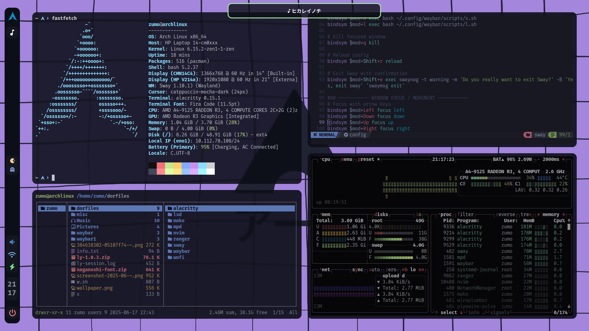
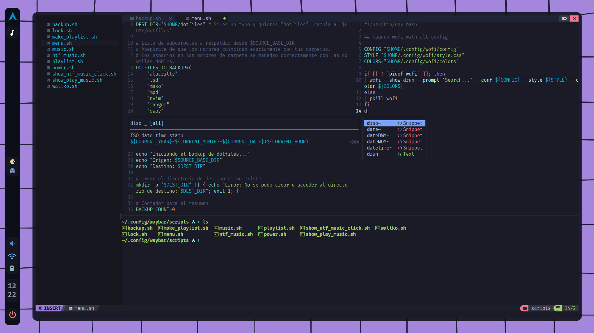
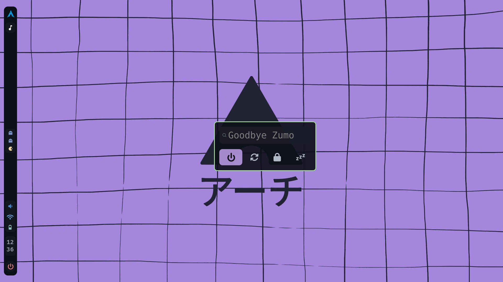
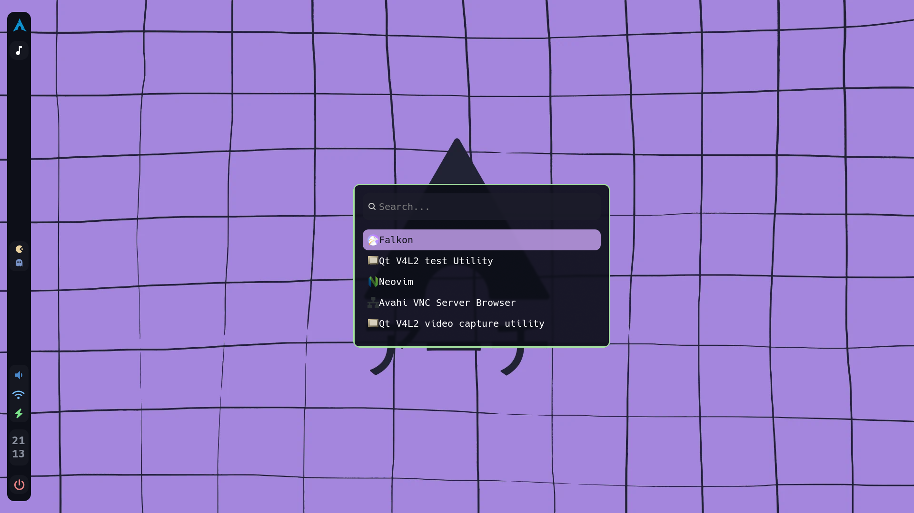
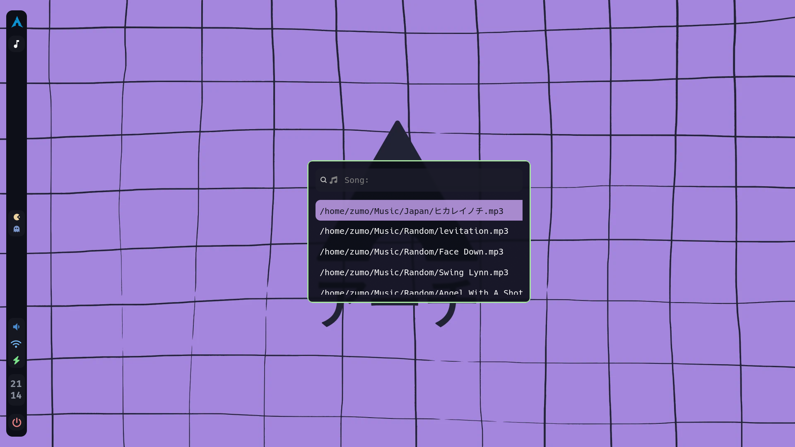
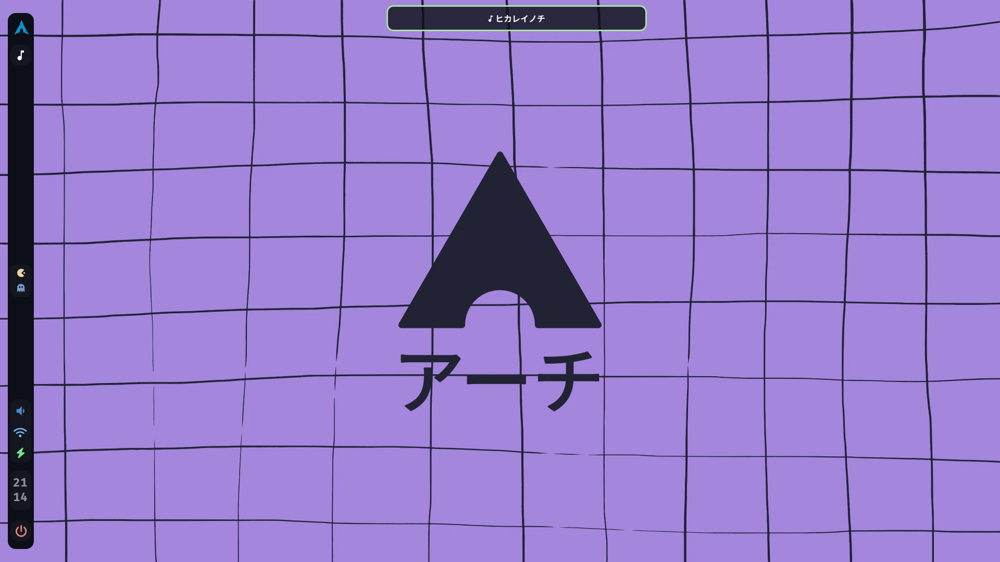
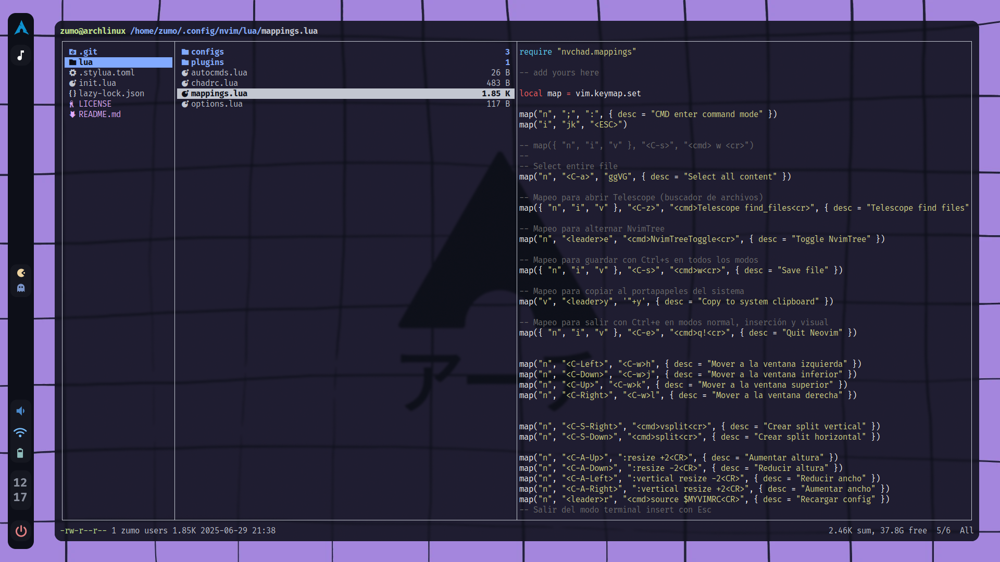
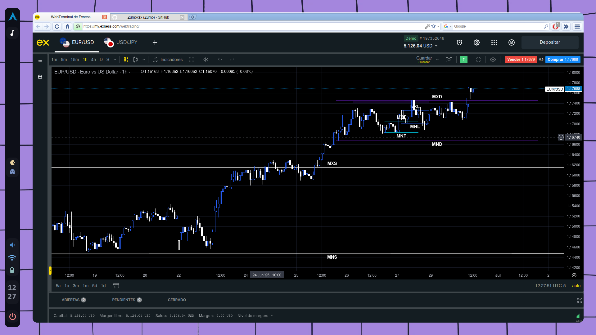

# SwayFX Dotfiles

My personal **SwayFX** dotfiles, inspired by [gh0stzk](https://github.com/gh0stzk/dotfiles?tab=readme-ov-file#-the-themes) z0mbi3 theme. It's not finished yet, but feel free to try it...


## 🧰 Included Applications

| Tool | Description |
|------|-------------|
| [SwayFX](https://github.com/WillPower3309/swayfx) | Wayland compositor with visual effects |
| [Waybar](https://github.com/Alexays/Waybar) | Highly customizable status bar |
| [Alacritty](https://github.com/alacritty/alacritty) | GPU-accelerated terminal |
| [Wofi](https://hg.sr.ht/~scoopta/wofi) | Wayland launcher (like rofi) |
| [Mako](https://github.com/emersion/mako) | Notification daemon for Wayland |
| [Neovim](https://neovim.io) | Modern extensible text editor |
| [Ranger](https://github.com/ranger/ranger) | Terminal file manager |
| [LSD](https://github.com/lsd-rs/lsd) | Improved `ls` command with icons |
| [MPD](https://www.musicpd.org) | Music player daemon |
| [Ly](https://github.com/fairyglade/ly) | Display Manager|

---

## 🖼️ Screenshots

### Full Desktop


### Neovim (nvchad)


### Power Menu


### Wofi


### Music (wofi)


### Music Notification (Mako)


### Ranger


### Browser (falkon)


---

## 🎹 Custom Keybindings

### 🪟 SwayFX

| Shortcut               | Action                                                   |
|------------------------|----------------------------------------------------------|
| `Super + Enter`        | Launch terminal                                          |
| `Super + D`            | Open app launcher                                        |
| `Super + P`            | Playlist selector                                        |
| `Super + Shift + P`    | Update playlist                                          |
| `Super + M`            | Music selector                                           |
| `Super + L`            | Lock screen                                              |
| `Super + Q`            | Close focused window                                     |
| `Super + Shift + R`    | Reload Sway config                                       |
| `Super + Shift + E`    | Exit Sway with confirmation (swaynag window)             |
| `Super + ←/↓/↑/→`      | Focus window directionally                               |
| `Super + Shift + ←/↓/↑/→` | Move window in direction                              |
| `Super + 1...5`        | Switch workspace                                         |
| `Super + Shift + 1...5`| Move window to workspace                                 |
| `Super + B`            | Split horizontally (splith)                              |
| `Super + V`            | Split vertically (splitv)                                |
| `Super + F`            | Toggle fullscreen                                        |
| `Super + Shift + Space`| Toggle floating mode                                     |
| `Super + Space`        | Toggle focus between tiling and floating                 |
| `Super + A`            | Focus parent container                                   |
| `Super + O`            | Toggle layout mode                                       |
| `Super + X`            | Send window to scratchpad                                |
| `Super + Z`            | Show scratchpad window                                   |
| `Super + R`            | Enter resize mode                                        |
| `XF86Audio...`         | Audio control                                            |
| `XF86MonBrightness...` | Screen brightness control                                |
| `Print`                | Screenshot (HDMI-A-1)                                    |
| `Shift + Print`        | Screenshot (eDP-1)                                       |
| `Super + Ctrl + ←/→`   | Next / Previous song in MPD                              |
| `Super + Ctrl + ↑`     | Play/Pause music (mpc toggle)                            |
| `Super + Ctrl + ↓`     | Play music (mpc play)                                    |
| `Super + S`            | Stop music (mpc stop)                                    |

---

### 📝 Neovim (NvChad base with custom mappings)

| Shortcut               | Action                                      |
|------------------------|---------------------------------------------|
| `Ctrl + A`             | Select entire file                          |
| `Ctrl + Z`             | Search files (Telescope)                    |
| `Leader + E`           | Toggle NvimTree                             |
| `Ctrl + S`             | Save file (in all modes)                    |
| `Leader + Y` (visual)  | Copy to system clipboard                    |
| `Ctrl + E`             | Quit Neovim without saving                  |
| `Ctrl + ←/↓/↑/→`       | Navigate splits                             |
| `Ctrl + Shift + →`     | Create vertical split                       |
| `Ctrl + Shift + ↓`     | Create horizontal split                     |
| `Ctrl + Alt + ↑/↓/←/→` | Resize splits                               |
| `Leader + R`           | Reload Neovim config                        |
| `Esc` in terminal mode | Exit terminal mode (to normal mode)         |

---

## ⚠️ Waybar only appears on HDMI monitor (HDMI-A-1)

This Waybar config is designed to run **only on an external monitor** (`HDMI-A-1`).

If you're using a single screen (like `eDP-1` on a laptop without HDMI), the bar **won't show up** by default.

🔧 To change this:

1. Open the file `~/.config/waybar/config`.
2. Find the line `"output": "HDMI-A-1"` and change it to `"output": "eDP-1"` or remove the line entirely to show on all screens.

You can also duplicate the configuration if you want bars on both monitors.

---

## ⚠️ Important note

This configuration is built for **laptops using dual monitor setups** (eDP-1 and HDMI-A-1).

If you're using **only one monitor** (like a desktop or single-screen laptop), make sure to:

- Edit the `sway/config` file and adjust workspace outputs.
- Update screenshot commands (`grim`) to match your screen setup.

Use `swaymsg -t get_outputs` to check your current monitor names.

---

## ⚠️ Other note
Your version of ly must be 1.0.3 for the configuration to work

---

## 🏗️ Installation

> ⚠️ This setup assumes you're using an Arch-based distribution. It can still be adapted to others.

### 1. Clone the repo

```bash
git clone https://github.com/Zumoxsx/swayfx.git ~/dotfiles
cd ~/dotfiles
 ```
### 2. Download the necessary packages and dependencies
```bash
sudo pacman -S sway waybar alacritty wofi mako neovim ranger mpd mpc brightnessctl lsd bat grim libnotify ly
```
#### AUR:
```bash
yay -S swayfx-git swaylock-effects downgrade
```
#### In downgrade select 1.0.3:
```
downgrade ly
```

### 3. Copy all configurations to their respective directories
```bash
cp -r sway ~/.config/
cp -r waybar ~/.config/
cp -r alacritty ~/.config/
cp -r wofi ~/.config/
cp -r mako ~/.config/
cp -r nvim ~/.config/
cp -r ranger ~/.config/
cp -r mpd ~/.config/
cp -r lsd ~/.config/
cp -r fonts /usr/share/fonts
fc-cache -fv
cp -r icons ~/.icons
cp .bashrc ~/
cp config.ini /etc/ly
```
### 4. Reboot
```bash
reboot
```
